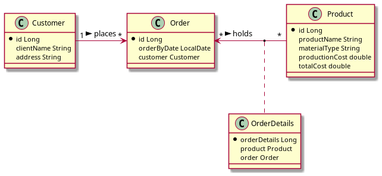
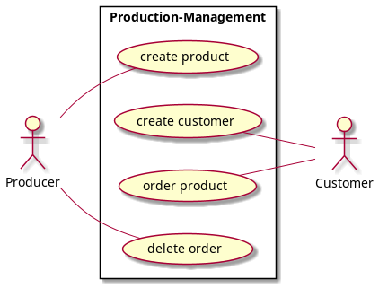

# Production Management (Bal)

The idea of this production management was to create a product.
The customer places an order which then adds the product which said customer wants.

## Class-Diagram

## Use-Case-Diagram

